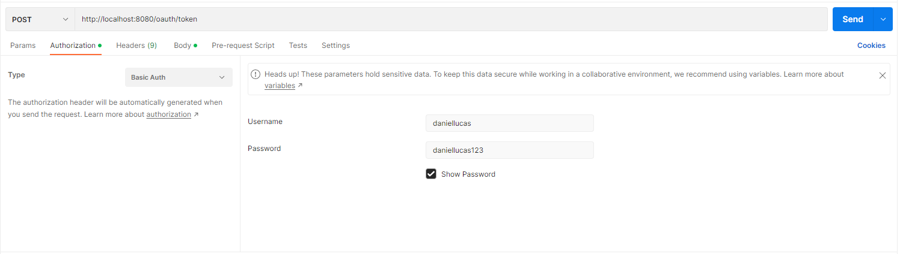
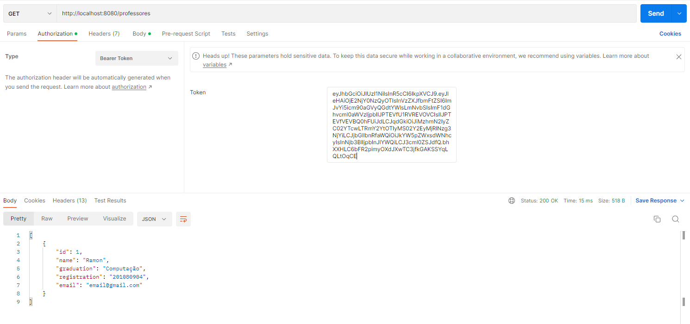

# Foobar

Realizado pelos alunos Daniel Xavier e Lucas Lucena

# SignUp e Autenticação:
Está sendo utilizada autenticação via Token JWT.

## Realizando o SignUp:
Utilize a a rota "/users" realize o post com o body contendo o seguinte json:

```javascript
{
    "firstName": "yourFirstName",
    "lastName": "yourLastName",
    "password": "yourPassword",
    "email": "email@gmail.com",
    "roles": [
        {
            "id": 1 // ROLE_STUDENT
        },
        {
            "id": 2 // ROLE TEACHER
        }
    ]
}
```
### Exemplo utilizando o Postman


## Capturando o Token JWT com o usuário criado anteriormente:

É necessario realizar um basicAuth utilizando exatamente as credenciais "daniellucas" para username e  "daniellucas123" para password:

Conjuntamente com a utilização das credenciais realizadas anteriormente (email e senha) no body da seguinte forma:

Resposta esperada com o token de autorização:


## Utilizado o Token JWT gerado anteriormente para a utilização das rotas:

Basta realizar uma autenticação do typo "Bearer Token" com o token adquirido anteriormente na rota desejada:
